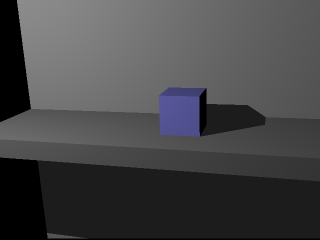

# raytracer
My attempt at a ray tracer, because (again), what else are you going to do during a pandemic?

# Resources

[OpenGL.org](http://www.opengl-tutorial.org/beginners-tutorials/)

[LearnOpengl.com (Basic Lighting)](https://learnopengl.com/Lighting/Basic-Lighting)

[ScratchPixel.com (Intro to Ray Tracing)](https://www.scratchapixel.com/lessons/3d-basic-rendering/introduction-to-ray-tracing)
